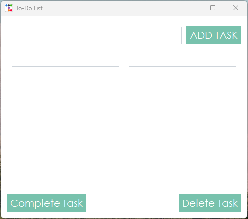

# To-Do List Application
This is a simple To-Do List application built using Tkinter and ttkbootstrap for an enhanced UI experience. The application allows users to:

-Add tasks to the list.

-Delete tasks from the list.

-Mark tasks as completed with a strikethrough effect.

## Features
✅ User-friendly UI with Tkinter and ttkbootstrap's "minty" theme. 
✅ Task management with a numbered list for easy reference.
✅ Completion marking using strikethrough formatting and a checkmark. 
✅ Warning messages to alert users when required actions are missing.

## Requirements
To run this application, you need:

-Python installed (3.x recommended)

-Tkinter (comes pre-installed with Python)

-ttkbootstrap package

-Install ttkbootstrap using:

```bash
pip install ttkbootstrap
```

## Usage
Run the script using:

```bash
python todo.py
```
Once launched, you can:

-Enter a task in the textbox and click "ADD TASK" to add it to the list.

-Select a task from the list and click "Delete Task" to remove it.

-Select a task and click "Complete Task" to move it to the completed section with a strikethrough effect.

## Code Overview
The application uses three main components:

-Task input frame (textbox for entering tasks & add button)

-Task display frame (listbox for active and completed tasks)

-Control buttons frame (delete and complete buttons)

Functions used:

```add_task()```: Adds a task to the list with numbering.

```del_task()```: Deletes selected task from active or completed lists.

```cmp_task()```: Marks selected task as completed with a strikethrough effect.

## Preview


The UI consists of:

-A textbox for entering tasks.

-A listbox displaying tasks.

-A secondary listbox showing completed tasks.

-Buttons to add, delete, or complete tasks.


## Contributing
Feel free to modify and improve the application! Contributions are welcome.

### Enjoy using your To-Do List 🎯
